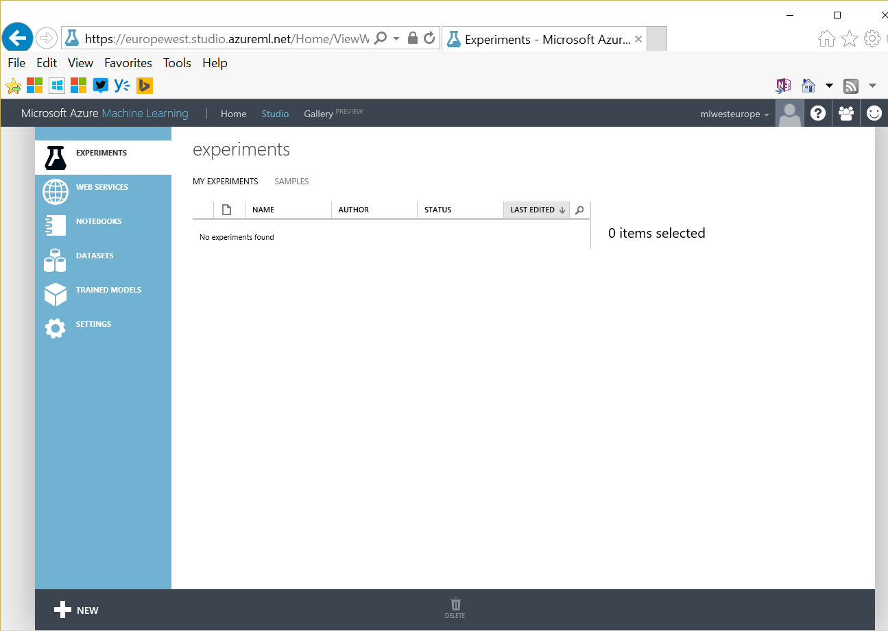

# Azure Machine Learning (Azure ML) (to be updated)

The main page where you can get documentation is at <http://azure.com/ml>. 

The studio is available at <https://studio.azureml.net>.

You may also want to visit the gallery where you'll get a lot of samples: <https://gallery.cortanaintelligence.com/>.

If you need more control and want to develop your own machine learning experiment you can use Azure ML Studio. 
While there is a free offer, as you get an Azure PASS, you might prefer to create an Azure ML environment from you Azure subscription first. If you do that, you'll get additional options like storing more data, having different endpoints (production, development, ...).

For that, go to [https://manage.windowsazure.com](https://manage.windowsazure.com), MACHINE LEARNING, and create a new workspace. 

prefer "West Europe" as location.

Then you can go to the [Azure ML studio](http://studio.azureml.net).

