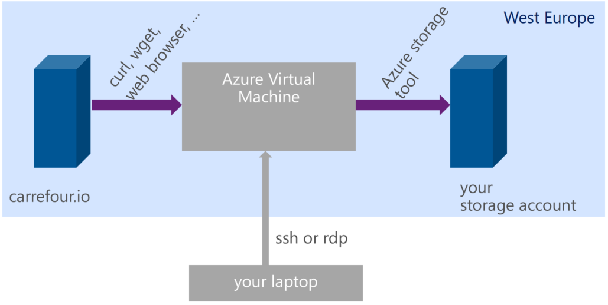
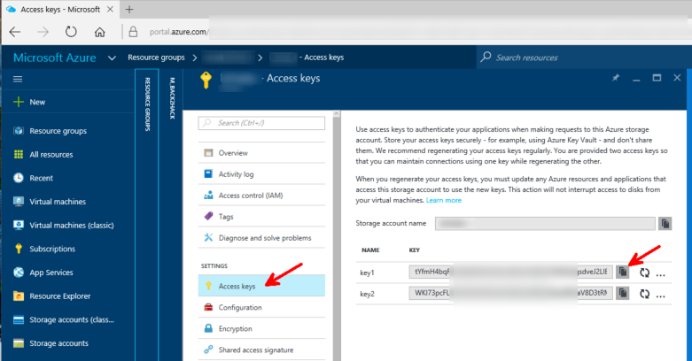
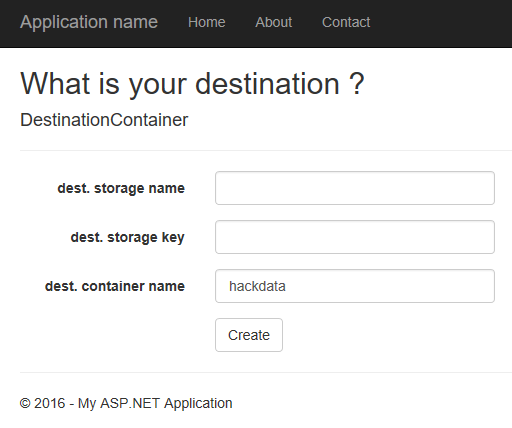
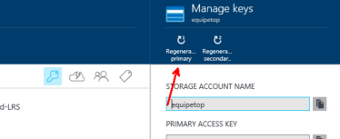

# Get the Data

A web application will copy the dataset to your Azure storage account. Here is how you can create a storage account and get the data. 

The steps are the following: 
- create a storage account on your subsription
- copy the storage key
- go to a web site and provide the storage name and the storage key
- the data is copied to your storage account

## create the storage account

Go to [http://portal.azure.com](http://portal.azure.com)

New, Data + Storage, Storage Account

NB: keep "Classic" in the "Select a deployment model"

Enter the following information with the following values (replace values in *italic* by your own values, some of them like the cluster name must be globally unique). The example values used at creation are reused in this documentation so that you can correlate the fields.

- Name: *equipetop*
- Deployment model: Resource manager
- Account Kind: Blob Storage
- Performance: Standard
- Replication: Locally Redundant (Standard-LRS)
- Access Tier: Hot
- Subscription: *(leave default or choose the subscription)*
- Resource Group: Create New, *equipetoprg*
- Location: West Europe

## copy the storage access key

Retrieve the storage key. You can use the primary access key or the secondary access key. 

## request the dataset on your storage

Go to the Web Site (the URL will be provided to you by the team)

Enter the following information: 

- dest. storage name: *equipetop*
- dest. storage key: *fRCyNyx1aHeASX1OTXrT8L7m0sMrGuEBrNFy6XghAwNZ3vwMXx5I7w4HluQ2qQrS8Cgy5qBK1YJbhQIWNvOMdw==*
- dest. storage container: (leave default: hackdata)

Click on `Create`. You'll get a confirmation message or an error. 

## You may change the key afterwards 

The web site does not keep your access key. 
Still, once you have the data, you can change the access key you provided.

